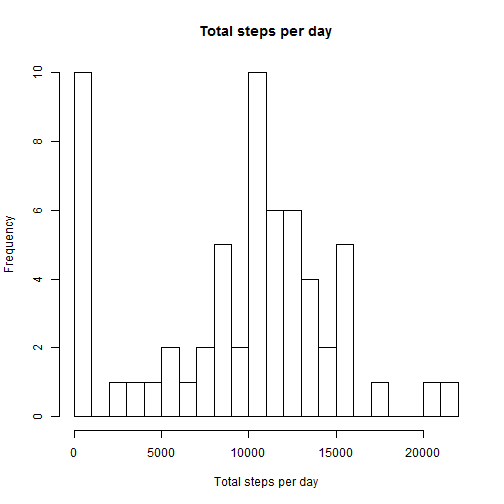
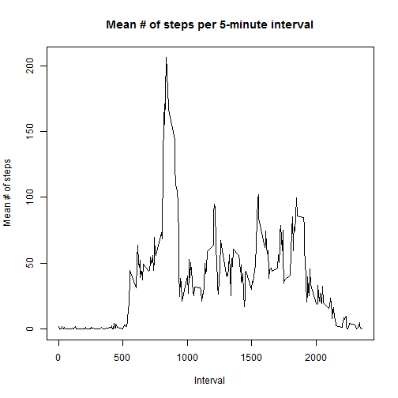
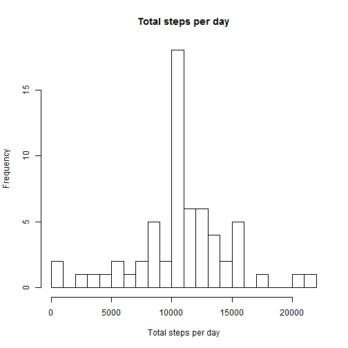

# Reproducible Research: Peer Assessment 1

## Loading and preprocessing the data

```r
# This code assumes the csv file is already in the working directory
activity <- read.csv("activity.csv")

# Convert the "date" variable to a Date class
activity$date <- as.Date(activity$date, format="%Y-%m-%d")
```


## What is mean total number of steps taken per day?

```r
# Use tapply to calculate total steps for each day, ignoring NA values
byday <- tapply(activity$steps, activity$date, sum, na.rm=TRUE)

# Generate histogram
hist(byday, breaks=20, main="Total steps per day", xlab="Total steps per day")
```

 

The histogram above shows the distribution of total steps per day. The mean and median total number of steps per day are, respectively:

```r
# Calculate mean and median of these daily totals
mean(byday, na.rm=TRUE)
```

```
## [1] 9354
```

```r
median(byday, na.rm=TRUE)
```

```
## [1] 10395
```


## What is the average daily activity pattern?

```r
# Calculate mean # of steps taken in each interval
byinterval <- tapply(activity$steps, activity$interval, mean, na.rm=TRUE)

# Create time series plot with this data
plot(names(byinterval), byinterval, type="l", main="Mean # of steps per 5-minute interval", xlab="Interval", ylab="Mean # of steps")
```

 

```r
# Find interval with max value
maxval <- names(which.max(byinterval))
```

The plot above shows the average number of steps taken for each 5-minute interval. The 5-minute interval with the maximum average number of steps was 835.

## Imputing missing values

```r
# Determine how many missing values there are
nummiss <- sum(is.na(activity$steps))
```
There are 2304 missing values in this dataset. A new dataset was created which replaced all missing values with the average number of steps for the 5-minute interval in which that missing value was found. The plot below shows a histogram using these imputed values.


```r
# Create new dataset where "NA" values in the "steps" variable are replaced by the average value for that interval (taken from "byinterval", which was created in the previous section)
activity1 <- activity
for(i in 1:length(activity1$steps)) {
        if(is.na(activity1$steps[i]))
                activity1$steps[i] <- byinterval[as.character(activity1$interval[i])]
}

# Use tapply to calculate total steps for each day
byday1 <- tapply(activity1$steps, activity1$date, sum)

# Generate histogram
hist(byday1, breaks=20, main="Total steps per day", xlab="Total steps per day")
```

 

The mean and median total number of steps per day using this new dataset where missing values were replaced with interval means are, respectively:

```r
# Calculate mean and median of these daily totals
mean(byday1)
```

```
## [1] 10766
```

```r
median(byday1)
```

```
## [1] 10766
```

## Are there differences in activity patterns between weekdays and weekends?

```r
# Create a new variable called "weekend" in the "activity1" data frame (the one with imputed missing values) indicating if the date is a weekend or weekday
for(i in 1:length(activity1$date)) {
        if(weekdays(activity1$date[i]) %in% (c("Saturday", "Sunday")))
                activity1$weekend[i] <- "weekend"
        else
                activity1$weekend[i] <- "weekday"
}

# Calculate means for each combination of the "interval" and "weekend" variables and then reshape it into a format that is usable with lattice's "xyplot" function. This may require installation of the "reshape" package
byinterval1 <- tapply(activity1$steps, list(activity1$interval, activity1$weekend), mean, na.rm=TRUE)
library(reshape)
```

```
## Warning: package 'reshape' was built under R version 3.0.3
```

```r
byinterval1 <- melt(byinterval1)
names(byinterval1) <- c("interval", "group", "average")

# Generate panel plot
library(lattice)
```

```
## Warning: package 'lattice' was built under R version 3.0.3
```

```r
xyplot(average ~ interval | group, data=byinterval1, layout=c(1,2), type="l", xlab="Interval", ylab="Number of steps")
```

 

Looking at the plots above, there does seem to be a difference in activity patterns between weekdays and weekends. 
